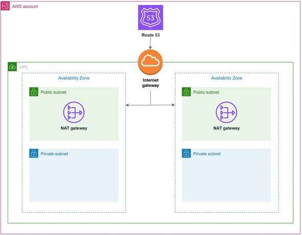
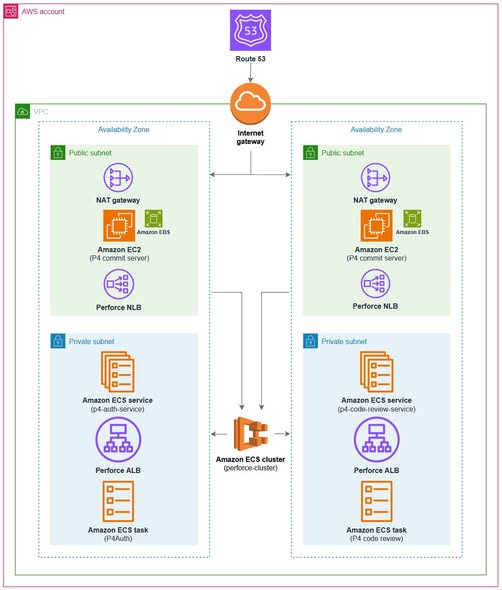
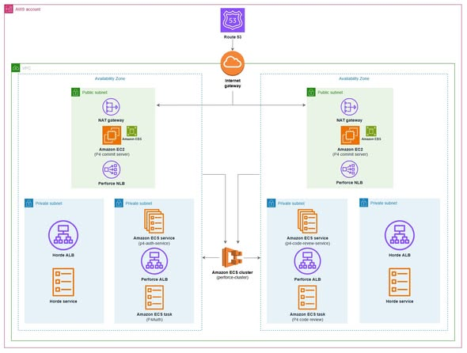

{}
⚠️ **Lưu ý:** Các thông tin dưới đây chỉ nhằm mục đích tham khảo, vui lòng **không sao chép nguyên văn** cho bài báo cáo của bạn kể cả warning này.
{}

# Hỗ trợ phát triển game với AWS Game Dev Toolkit 
    Trong quá trình phát triển game, các studio thường gặp nhiều khó khăn trong việc xây dựng hệ thống quản lý mã nguồn, tự động hóa quy trình build và triển khai hạ tầng. Đối với các nhóm làm việc từ xa hoặc phát triển những dự án có quy mô lớn, việc tự xây dựng và vận hành hạ tầng có thể tiêu tốn rất nhiều thời gian và chi phí.

Để giải quyết vấn đề này, AWS đã phát triển Cloud Game Development Toolkit. Đây là bộ công cụ mã nguồn mở cung cấp các mẫu Terraform và Packer được cấu hình sẵn, giúp các studio game nhanh chóng triển khai hạ tầng phát triển trên AWS, tăng hiệu quả làm việc và giảm thời gian thiết lập từ nhiều tuần xuống chỉ còn vài giờ.
# Những thách thức trong phát triển game
Việc xây dựng một dự án game hiện đại thường phải đối mặt với nhiều khó khăn như:
Thời gian build dài và dễ xảy ra lỗi.
Quản lý tài nguyên game dung lượng lớn gặp nhiều hạn chế.
Khó khăn trong việc cộng tác giữa các thành viên ở nhiều địa điểm khác nhau.
Thiếu hệ thống CI/CD và quản lý phiên bản phù hợp cho các dự án quy mô lớn.
Chi phí đầu tư phần cứng và vận hành hạ tầng cao.
# Giải pháp với AWS Cloud Game Development Toolkit
Cloud Game Development Toolkit cung cấp các thành phần cần thiết để xây dựng môi trường phát triển game trên AWS:
# Quản lý mã nguồn với Perforce
Toolkit hỗ trợ triển khai nhanh hệ thống Perforce P4 trên AWS, bao gồm:
Máy chủ Perforce chạy trên Amazon EC2 và Amazon EBS.
Dịch vụ xác thực và kiểm duyệt mã nguồn chạy trên Amazon ECS.
Tự động cấu hình xác thực và kết nối cho nhóm phát triển.
Nhờ đó, các thành viên trong nhóm có thể dễ dàng chia sẻ tài nguyên, quản lý phiên bản và cộng tác hiệu quả hơn.
# Tăng tốc quy trình Build với Horde
Đối với các dự án Unreal Engine, Toolkit hỗ trợ triển khai Unreal Engine Horde – hệ thống CI/CD chuyên dụng cho phát triển game.
Các tính năng nổi bật bao gồm:
Tự động hóa quy trình build và kiểm thử.
Hỗ trợ Build Agents tự động mở rộng theo nhu cầu.
Tích hợp trực tiếp với Perforce.
Cung cấp giao diện giám sát và quản lý build trực quan.
Hỗ trợ Unreal Build Accelerator giúp tăng tốc độ biên dịch.
# Kiến trúc giải pháp trên AWS
Cloud Game Development Toolkit tận dụng nhiều dịch vụ AWS như:
Amazon VPC và Amazon Route 53 để xây dựng hạ tầng mạng.
Amazon EC2 và Amazon EBS cho máy chủ xử lý chính.
Amazon ECS để chạy các dịch vụ container.
Amazon DocumentDB và Amazon ElastiCache hỗ trợ Horde.
AWS Certificate Manager để quản lý chứng chỉ bảo mật.
Toàn bộ hạ tầng được triển khai bằng Infrastructure as Code (IaC), giúp dễ dàng quản lý, mở rộng và tái sử dụng.
# Tác động và lợi ích
Cloud Game Development Toolkit mang lại nhiều lợi ích cho các studio game:
Triển khai hạ tầng nhanh chóng chỉ trong vài giờ.
Tự động áp dụng các AWS Best Practices.
Dễ dàng mở rộng quy mô khi dự án phát triển.
Tối ưu chi phí nhờ Auto Scaling và EC2 Spot Instances.
Giúp đội ngũ tập trung vào phát triển game thay vì quản lý hạ tầng.
# KẾT LUẬN
Thông qua Cloud Game Development Toolkit, AWS giúp các studio game xây dựng môi trường phát triển hiện đại, linh hoạt và tiết kiệm chi phí, từ đó đẩy nhanh quá trình đưa sản phẩm ra thị trường.
# Hình ảnh

# Link tài liệu: 
https://aws.amazon.com/vi/blogs/gametech/game-development-infrastructure-simplified-with-aws-game-dev-toolkit/
