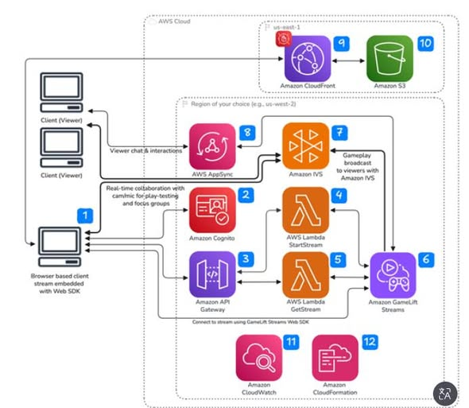

# [AWS Tech Share] Transforming Spectators into Players: Building Interactive Gaming Experiences with Amazon GameLift Streams & Amazon IVS
Today, I want to explore how AWS addresses the "Interactive Streaming" challenge—bridging the gap between passive viewers and active gameplay through two-way, ultra-low latency real-time interactions.

In traditional game development, managing playtests is a time-consuming process that involves downloading game builds, setting up the hardware, and manually reviewing recorded gameplay videos. Similarly, community engagement on streaming sites is often limited to text-based chats. To overcome these limitations, AWS has put forward an elegant, integrated solution architecture.

# The 3 Core Pillars of the Architecture
1. **Amazon GameLift Streams:** Enables hosting and streaming gameplay instances directly from cloud servers to a client browser using WebRTC. It delivers high-fidelity streams (up to 1080p at 60 FPS) with sub-second latency, without requiring the end-user to download or install the game client.
2. **Amazon IVS (Interactive Video Service):** Ingests the gameplay stream and distributes it to a global audience with sub-second delivery latency.
3. **AWS AppSync:** Serves as the real-time websocket backbone, routing chat messages, emotes, and interactive inputs from the viewer interface back into the game engine instantly.

# System Architecture Flow
- Users interact with a dynamic React Frontend web application. Secure client authentication is managed by Amazon Cognito.
- Amazon API Gateway and AWS Lambda act as the orchestrator to initiate and manage stream sessions.
- On the server side, Amazon GameLift Streams runs the game binary while launching an auxiliary background daemon called the "Broadcast Sidecar".
- This Broadcast Sidecar captures real-time video and audio from the game window, encodes the output using H.264, and pushes the media stream directly onto the Amazon IVS stage with a transit latency of under 300ms.

# Technical Deep Dive: The "Control Handoff" Mechanism
The standout feature of this solution is the seamless "Control Handoff" to viewers. The architecture coordinates state control signals through the AWS AppSync Event API. Key messages include:
- **`TAKEOVER_REQUEST`:** Sent when a viewer requests active control from the current player.
- **`TAKEOVER_APPROVED`:** Sent when the server approves the transfer and initiates the interactive session via the `CreateStreamSessionConnection` API.

# Summary
This interactive streaming architecture does more than just optimize internal studio playtests—it opens up exciting new possibilities for marketing campaigns. Audiences can now participate directly in gameplay events (such as voting on paths or spawning enemies) right from their web browser with virtually zero latency friction.

# Images

# Reference Link:
https://aws.amazon.com/blogs/gametech/creating-interactive-gaming-experiences-with-amazon-gamelift-streams-and-amazon-interactive-video-service/