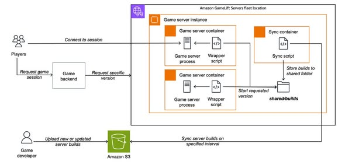

# Exploring the Multi-Build Solution on Amazon GameLift Servers
## Introduction
During online game development, testing and iterating on various game server builds is a continuous and critical task. However, deploying a full, separate infrastructure fleet for every new iteration can be highly time-consuming, bottlenecking your quality assurance (QA) and playtesting pipelines.

To address this friction, AWS introduced the Multi-Build solution for Amazon GameLift Servers. This feature enables developers to store and run multiple server builds on the same fleet, dramatically speeding up game iteration and validation cycles.

# What is Amazon GameLift?
Amazon GameLift is a fully managed hosting service provided by AWS for multiplayer game servers. It assists developers in deploying, operating, and scaling dedicated game servers worldwide, ensuring high performance, low latency, and cost-efficiency for millions of concurrent players.

# The Bottleneck in Traditional Iteration
In standard workflows, deploying a new game server version usually requires developers to:
1. Re-compile and package the game server application.
2. Build and redeploy the entire fleet infrastructure.
3. Verify the deployment and ensure connectivity.
4. Manually switch between different fleets to test different versions.
This cycle takes significant time, especially during intense Alpha and Beta phases where updates are frequent.

# The Multi-Build Solution
The Multi-Build approach allows multiple game server builds to reside on the same Amazon GameLift fleet simultaneously. Instead of rebuilding or redeploying the underlying fleet for every code update, the workflow is simplified:
1. **Upload builds to Amazon S3:** Package and upload the new build to a centralized S3 bucket.
2. **Automatic Synchronization:** A background process syncs the files directly to the active GameLift server instances.
3. **Targeted Execution:** When initializing a Game Session, specify the desired `BuildVersion`.
4. **Dynamic Launch:** The server launcher automatically triggers and executes the corresponding version.
This mechanism makes version transitions fast, fluid, and resource-efficient.

# Architecture and Mechanics
The solution is built around a dual-container setup operating in tandem:

## 1. Game Server Container
- Hosts and runs the active game server instances.
- Intercepts incoming game session initialization requests.
- Launches the correct game server binary matching the requested `BuildVersion`.

## 2. S3 Sync Container
- Runs constantly in the background.
- Scans a specified Amazon S3 bucket for changes or new uploads.
- Downloads new build variants to a shared local directory.
- Prunes obsolete or unused builds to manage local disk space.
- Ensures all assets are fully downloaded and verified before execution.

Both containers access a shared storage volume to enable the Game Server Container to find and run the synchronized builds.

# AWS Services Integrated
The Multi-Build solution orchestrates several core AWS services:
- **Amazon GameLift Servers:** Manages the game sessions and host instances.
- **Amazon S3:** Serves as the primary registry and repository for game build files.
- **Amazon ECR:** Manages container images for both the Game Server and Sync services.
- **AWS IAM:** Controls secure access between containers, S3, and GameLift.
- **AWS CodeBuild:** Automates the packaging and container building pipeline.
- **AWS CloudFormation:** Provides Infrastructure as Code templates for automated setup.
- **Amazon CloudWatch Logs:** Collects telemetry, logs, and metrics for auditing and debugging.

# Core Benefits of Multi-Build
- **Accelerated Development:** Engineering teams can run and test various game builds concurrently on a single fleet.
- **Substantial Time Savings:** Uploading a new build takes minutes, avoiding the lengthy delay of provisioning new fleets.
- **Streamlined Playtesting:** Different versions of a game can run in parallel, letting developers target specific playtest demographics or experiment with features.
- **Simple Infrastructure footprint:** Simplifies fleet management by centralizing build assets on S3 and auto-syncing them.

# Conclusion
The Amazon GameLift Multi-Build solution is a game-changer for development teams looking to speed up their testing and release velocity. By hosting multiple builds on a single fleet, AWS significantly reduces deployment overhead and optimizes the game iteration cycle. If your project is currently in Alpha, Beta, or heavily iterating on features, adopting this pattern will bring substantial value.

# Images

# Reference Link:
https://aws.amazon.com/vi/blogs/gametech/rapid-game-server-iteration-on-amazon-gamelift-servers/