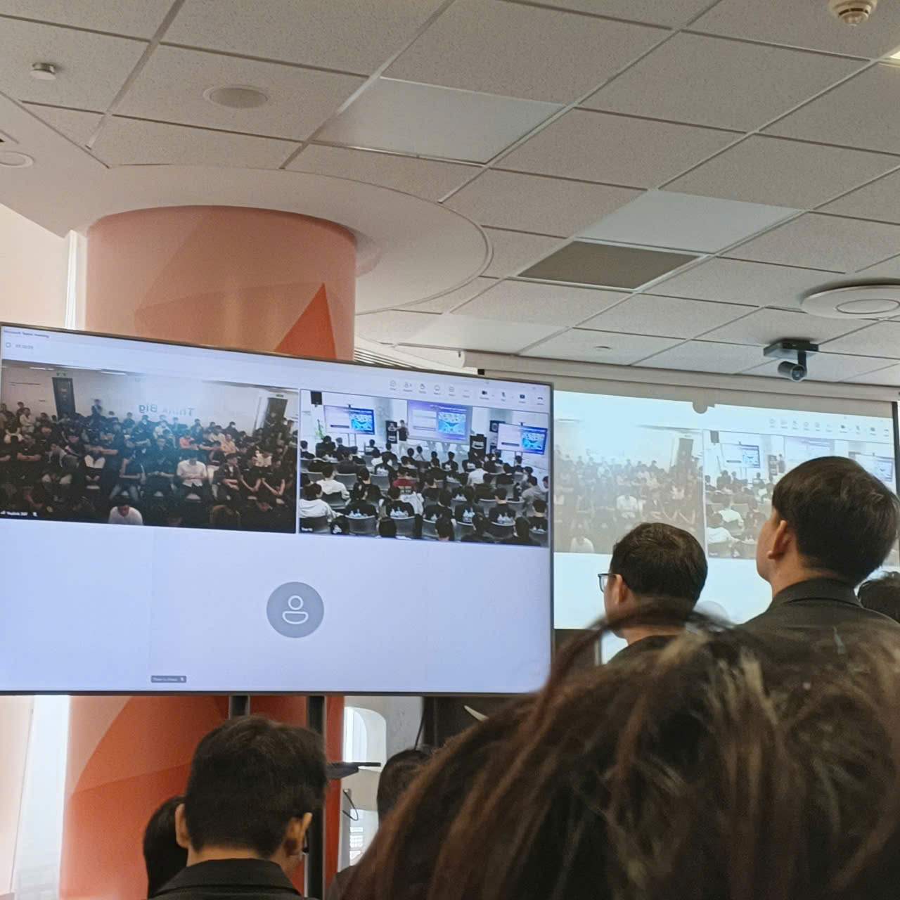
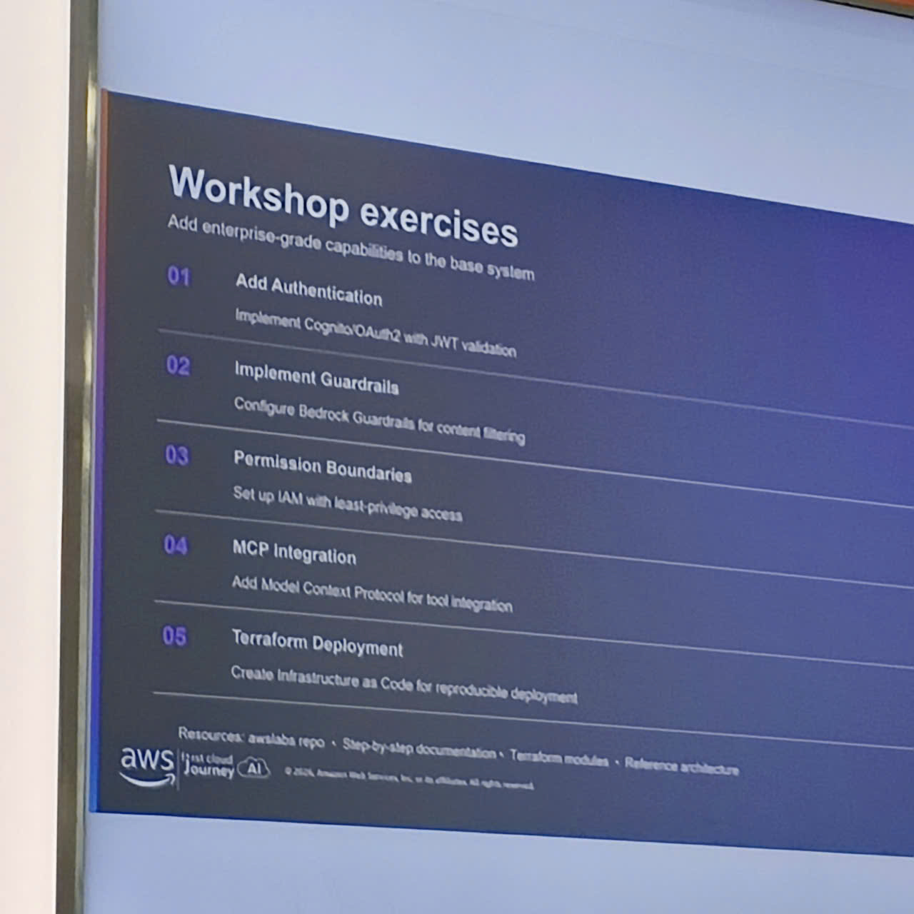
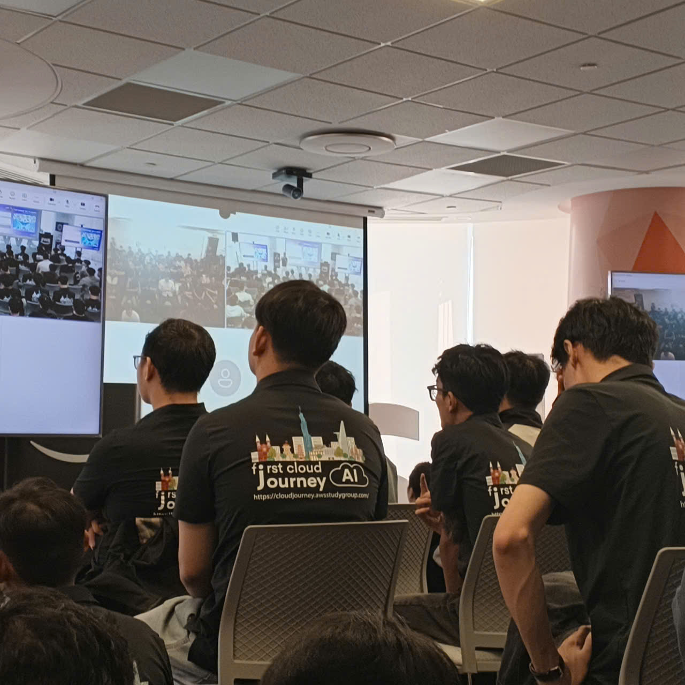

# Report: GenAI-powered App-DB Modernization Workshop & AWS Community Day

## Executive Summary
This workshop highlighted cutting-edge trends in Artificial Intelligence (GenAI), Large Language Model (LLM) architectures, and cloud network optimizations. Industry leaders from VPBank, GoTymeX, and Cloud Kinetics shared practical strategies for deploying Multi-Agent systems, mastering context engineering, and optimizing CDN caching behaviors for large-scale operations.

---

## Detailed Session Summary & Technical Highlights

### 1. Enterprise Multi-Agent Workflows
* **Speaker:** Vy Lam (VPBank)
* **The Challenge:** Traditional banking credit evaluations demand years of financial records and collateral, matching poorly with early-stage startups that possess mostly operational and unstructured data.
* **The Solution:** A collaborative *Virtual Credit Committee* comprising specialized AI Agents (Financial Analyst, Compliance, Risk Assessor) communicating via the Model Context Protocol (MCP).
* **Outcomes:** Reduced evaluation times from weeks to under 4 hours, achieving over 90% cost savings. Security was managed through Bedrock AgentCore and guardrails protecting PII.

### 2. Large Language Model Non-Determinism
* **Speaker:** Đức Đào (Cloud Kinetics)
* **Key Concept:** Greedy Decoding ($T = 0$) does not guarantee perfectly identical model responses due to GPU hardware architectures, floating-point calculation errors, and modern inference execution plans.
* **Best Practices:** Setting temperature slightly above zero ($T = 0.1$) to prevent repetitive loop traps, utilizing repetition penalties, and enforcing structured JSON schemas at the API parameter level.

### 3. Rapid Prototyping under Constraints
* **Case Study:** Team VIB (UTMorpho Project at Lotus Hacks)
* **Key Lessons:** Navigating severe token limits, time pressures, and team burnout during a 36-hour hackathon. The team succeeded by implementing focused coding isolation and maintaining tight API design schemas.

### 4. Administrative Automation with Amazon Q
* **Speaker:** Hải Anh (G-AsiaPacific)
* **The Solution:** Automating enterprise administrative tasks by integrating Amazon Q with enterprise data sources. An automated PM Assistant compiled meeting summaries, drafted action items, and scheduled follow-ups.

### 5. Edge Optimization & Cost Controls
* **Speaker:** Tuấn Thịnh (DevOps Engineer)
* **Key Concepts:** Using CloudFront subscription models to protect backend servers from unexpected cost spikes caused by DDoS attacks.
* **Performance Gain:** Using 700+ Edge points of presence (PoPs) to cache static assets reduced origin CPU load from 5% to 1%. Utilizing HTTP/3 multiplexing lowered request latencies by 81% (from 123ms to 24ms).

### 6. Context Engineering Frameworks
* **Speaker:** Tịnh Trương (GoTymeX)
* **Core Insight:** Low-quality LLM responses are typically caused by weak context inputs, not model flaws.
* **Pitfalls to Avoid:** Cramming large files directly into the prompt context (*the internet puller*), over-explaining standard technology setup steps, and failing to provide structural constraints.
* **Simple Context Framework:** A prompt must define four pillars: **Goal**, **Relevant Info**, **Constraints**, and **Success Criteria**.

---

## Reflections & Career Implications

### System Design Takeaways
* **Business-First Approach:** Engineering choices should always focus on solving user friction rather than chasing technical trends.
* **Probabilistic Architectures:** Modern developers must design validation loops around LLM APIs to handle output variances gracefully.
* **Edge Caching Benefits:** Deploying routing checks and URL rewrites directly via CloudFront/Lambda@Edge reduces backend resource costs.

### Practical Engineering Commitments
* Adopting the **Goal-Info-Constraints-Criteria** framework for all prompt construction.
* Designing agentic systems for unstructured data processing using tools and MCP schemas.
* Routing static assets and public APIs through CDN layers with strict origin cloaking.

---

## Event Photos

