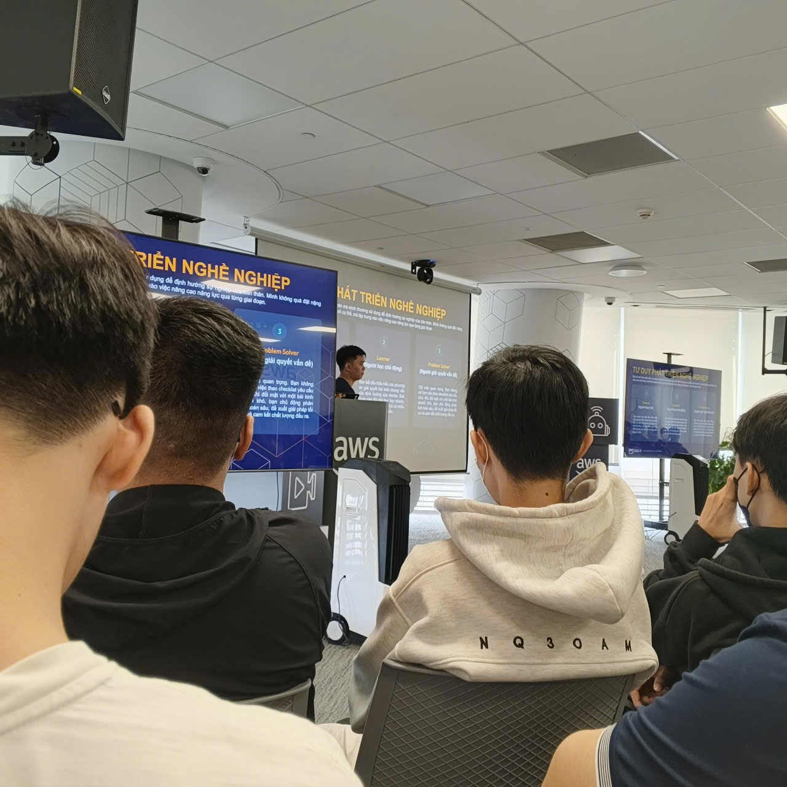
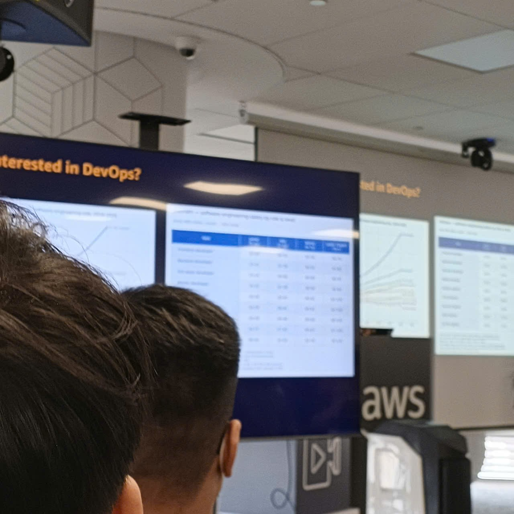
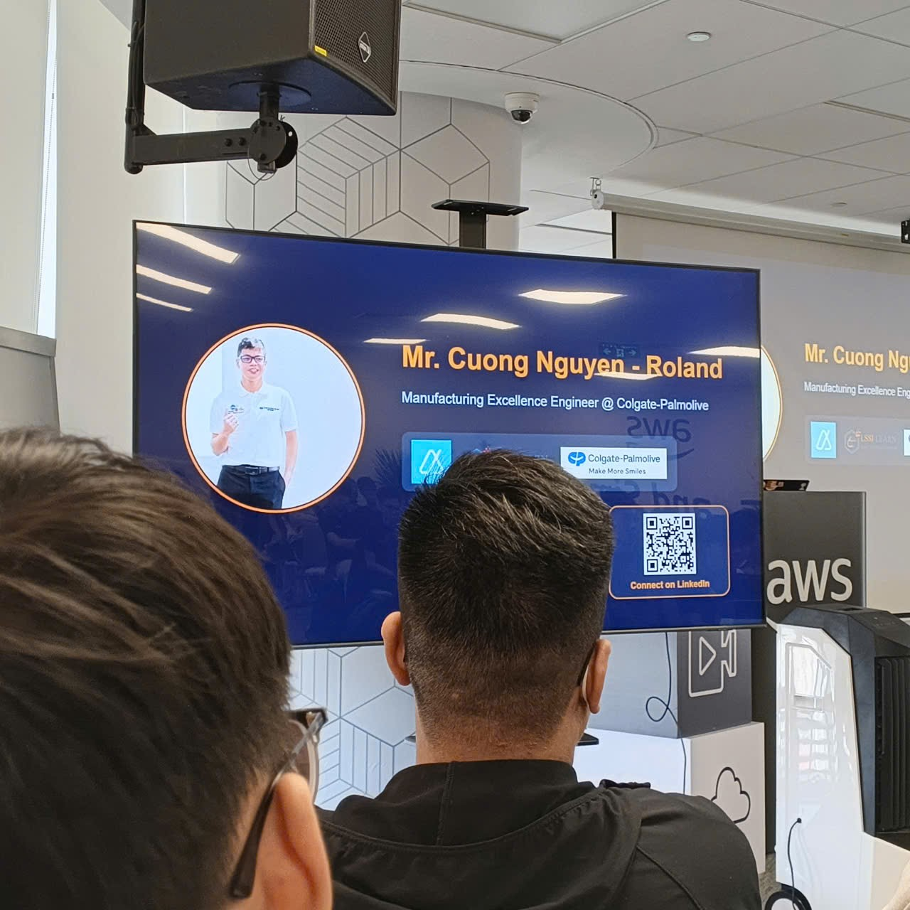

# Báo cáo kỹ thuật: Buổi chia sẻ về Hiện đại hóa Kiến trúc Cloud-Native & DevOps

## Tóm tắt sự kiện
Buổi chia sẻ kỹ thuật này tập trung thảo luận về việc tối ưu hóa kiến trúc phần mềm, xây dựng hệ thống microservices giảm liên kết chéo (loose coupling) thông qua phương pháp Domain-Driven Design (DDD) và tự động hóa vận hành ở quy mô lớn. Các chuyên gia giàu kinh nghiệm từ AWS và các đối tác công nghệ đã chia sẻ nhiều bài học thực chiến, giúp định hình tư duy thiết kế hệ thống và lộ trình nâng cao năng lực cho thế hệ kỹ sư mới.

## Nội dung chia sẻ & Diễn giả
* **Đinh Trung Kiên & Nguyễn Minh Thọ:** *Triển khai và co giãn dịch vụ rút gọn liên kết (URL Shortener) trên AWS*
* **Đạt Phạm & Cường Nguyễn:** *Thực tế văn hóa doanh nghiệp và lộ trình nghề nghiệp tại các tập đoàn đa quốc gia (MNCs)*
* **Solutions Architect (SA):** *Đi sâu vào thế giới Serverless và các mẫu tích hợp hệ thống cốt lõi*
* **Danh Hoàng Hiếu Nghị:** *Hành trình đồng hành: Từ học viên First Cloud AI Journey trở thành Đối tác của AWS*
* **Trọng H. Trương (DevOps Engineer):** *Bản chất của kỹ nghệ tự động hóa hạ tầng và công việc của kỹ sư DevOps*

---

## Kiến thức kỹ thuật & Các phân tích chuyên sâu

### 1. Hạn chế của các hệ thống Monolithic cũ
Sự kiện đã phân tích kỹ lưỡng những điểm nghẽn của kiến trúc ứng dụng kiểu cũ:
* **Tốc độ bàn giao chậm:** Việc triển khai thủ công khiến chu kỳ ra mắt tính năng mới bị kéo dài, giảm khả năng phản hồi trước nhu cầu thị trường.
* **Lãng phí tài nguyên tính toán:** Kiến trúc nguyên khối gây khó khăn cho việc co giãn độc lập, dẫn đến hóa đơn cloud tăng cao do dư thừa tài nguyên.
* **Rủi ro bảo mật hệ thống:** Các thư viện cũ không được cập nhật kịp thời tạo ra các lỗ hổng an ninh nguy hiểm cho toàn bộ hệ thống.

### 2. Thiết kế Microservices dựa trên nghiệp vụ (Domain-Driven Design)
Để xây dựng các dịch vụ microservices hoạt động độc lập và hiệu quả, nhóm công nghệ cần áp dụng các nguyên lý:
* **Giao tiếp bất đồng bộ:** Tận dụng hàng đợi tin nhắn (Message queues) để tách biệt luồng xử lý và giảm phụ thuộc chéo giữa các service.
* **Kỹ thuật Event Storming:** Tổ chức thảo luận để bóc tách luồng nghiệp vụ thành chuỗi sự kiện $\rightarrow$ định danh tác nhân $\rightarrow$ xác định ranh giới ngữ cảnh (Bounded contexts).
* **Vạch rõ ranh giới cơ sở dữ liệu:** Đảm bảo mỗi microservice sở hữu cơ sở dữ liệu riêng biệt để tránh tình trạng liên kết cơ sở dữ liệu chéo (database coupling).

### 3. Dịch chuyển hạ tầng lên Serverless
Hiểu rõ đặc điểm của từng loại dịch vụ tính toán giúp tối ưu hóa hệ thống:
* **Dải quang phổ hạ tầng (Compute Spectrum):** So sánh và đánh giá các giải pháp Máy ảo (EC2), Container (ECS/Fargate) và Serverless (AWS Lambda).
* **Ưu điểm của Serverless:** AWS chịu trách nhiệm quản lý máy chủ vật lý, hệ thống tự động co giãn theo lượng truy cập thực tế và mô hình tính phí pay-per-value (chỉ trả tiền khi sử dụng thực tế).
* **Ứng dụng AI trợ lý:** Trải nghiệm Amazon Q Developer trong việc tự động nâng cấp phiên bản code và di trú hạ tầng.

### 4. Vận hành DevOps & Ứng dụng dữ liệu thực tế
* **Mục tiêu DevOps:** Tập trung xây dựng các quy trình CI/CD ổn định, quản lý hạ tầng dạng mã (IaC), và tối ưu hóa hệ thống giám sát để phòng ngừa lỗi từ sớm thay vì đối phó bị động.
* **Phân tích dữ liệu thực tế:** Các ví dụ cụ thể về giám sát thiết bị IoT tại Colgate-Palmolive để tối ưu chi phí sản xuất, hay thiết kế dashboard vận hành tại Kamereo giúp minh họa rõ nét cách ứng dụng dữ liệu để giải quyết bài toán kinh doanh.

---

## Bài học kinh nghiệm & Định hướng công việc

### Bài học phát triển bản thân
* **Văn hóa Không Đổ Lỗi (No-Blame Post-Mortem):** Tập trung thảo luận tìm nguyên nhân gốc rễ để cải tiến hệ thống khi xảy ra sự cố nghiêm trọng, không quy trách nhiệm cho cá nhân.
* **Lộ trình phát triển:** Nâng tầm bản thân từ người thực hiện yêu cầu có sẵn (*Follower*) lên người giải quyết các bài toán cốt lõi (*Problem Solver*) với tư duy toàn cảnh (*System Thinker*).
* **Quy trình tuyển dụng:** Chuẩn bị phỏng vấn với các tập đoàn lớn thông qua tối ưu hóa hồ sơ với ATS và trả lời theo mô hình STAR.

### Ứng dụng vào bài tập lớn / Công việc
* Áp dụng Event Storming để chuẩn hóa ngôn ngữ chung (Ubiquitous Language) giữa các thành viên dự án.
* Chuyển đổi các kết nối API đồng bộ sang hàng đợi SQS để tăng khả năng chịu tải cho hệ thống đặt vé.
* Tích hợp Amazon Q Developer vào quy trình viết và kiểm thử code hàng ngày.

---

## Hình ảnh sự kiện

